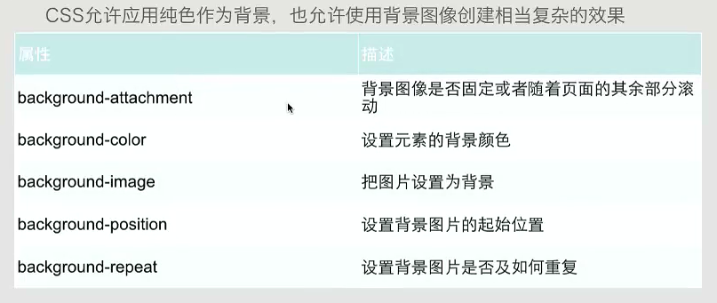

# CSS3

* 属性选择器：对带有指定属性的HTML元素设置样式
  ```css
    [title] {
      color:red
    }
    [title=te] {
      color:blue
    }
    <p title='t'>123</p>
    <p title='te'>213</p>
  ```

* CSS背景



* position属性
  * static
  * relative
  * absolute
  * fixed

* float属性
  * left
  * right
  * none
  * inherit:从父级继承浮动属性

* clear属性（去掉浮动属性，包括继承来的属性）
  * left、right
  * both
  * inherit

* css3边框
  * border-radius：圆角边框
  * box-shadow：边框阴影
  * border-image:边框图片

* 对齐操作
  * 使用margin属性进行水平对齐
  * 使用position属性进行左右对齐
  * 使用float属性进行左右对齐

* css3选择器
  * 元素选择器
  * 选择器分组
  * 类选择器
    * 多类选择器：.class.class{}
  * ID选择器
  * 属性选择器
  * 后代选择器:用空格隔开
  * 子元素选择器：用>隔开
  * 相邻兄弟选择器：用+隔开

* 2D转换元素 transform:
  * translate() 移动，（x轴上移动距离，y轴上移动距离）
  * rotate() 旋转（旋转的角度90deg）
  * scale() 缩放，（宽度缩放比例，高度缩放比例）
  * skew() 倾斜，（围绕x轴旋转角度，围绕y轴旋转角度）
  * matrix() 矩阵

* 3D转换元素
  * rotateX() X轴旋转
  * rotateY() Y轴旋转

* 过渡 transition：（改变的样式，时间）
* 动画：

```css
div {
  /* 只执行一次 */
  animation: anim 5s;
  /* 执行多次 */
  animation: anim 5s infinite alternate;
}
@keyframes anim{
  0%{background: red;left:0}
  25%{background: blue;left:10}
  50%..
  75%..
  100%..
}
```

* 多列
  * column-width 列的宽度
  * column-count 列的数量
  * column-gap 列间间隔
  * column-rule 分割列的线样式（5px outset #fff）