# HTML5学习

## HTML5的新特性

* 用于绘画的canvas标签
* 用于媒介回放的video和audio元素
* 对本地离线储存的更好支持
* 新的特殊内容元素：article、footer、header、nav、section等
* 新的表单控件：calendar、data、time、email、url、search
* 浏览器的支持：Safari、Chrome、Firefox以及Opera包括IE9基本支持了HTML5

## HTML5语法的改变

* DOCTYPE声明
  * < !DOCTYPE html>
* 指定字符编码
  * < meta charset='UTF-8'>
* 可以省略标记的元素
  * 
* 具有boolean值的属性
  * 只写属性不写属性值或值为空字符串或值为属性名都为true
* 省略引号
  * 属性的值可以省略引号
* 新增的结构元素
  * section（内容块）、article（与上下文无关的文章）、aside（article的辅助信息）、header、hgroup、footer、nav、figure
* 新增的其他元素
  * video、audio、embed、mark、progress、meter、time、ruby、rt、rp、wbr、canvas、command、details、detalist、datagrid、keygen、output、source、menu
* 新增的input元素的类型
  * email、url、number、range、Date Pickers
* 废除的元素
  * 能用CSS替代的元素：basefont、big、center、font、s、tt、u等
  * 不再使用frame框架
  * 只有部分浏览器支持的元素
  * 其他被废除的元素
* 新增的属性
  * 表单相关的属性
  * 链接相关的属性
  * 其他属性
* 废除的属性
* 全局属性
  * contentEditable属性（使元素可编辑）
  * designMode属性
  * hidden属性（使元素隐藏）
  * spellcheck属性（使input和textarea拥有拼写检查）
  * tabindex属性（设置按tab键跳转的顺序）

## 新增结构元素

* article

* section(不要作为设置样式的容器)

* nav

* aside

* time元素与微格式、pubdate属性

## 新增非主体结构元素

* header元素

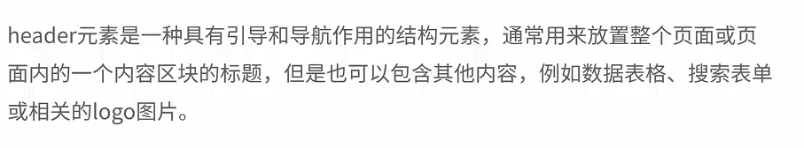

* footer元素

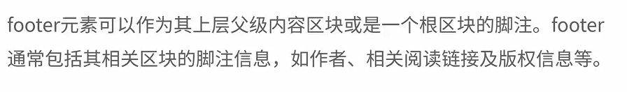

* hgroup元素

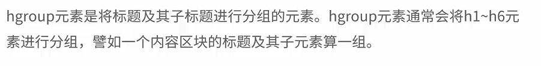

* address元素

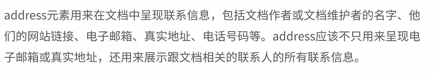

## HTML5网页编排规则

1. 显示编排内容区域块
  * 使用section等元素创建每一块
2. 隐式编排内容区域块
  * 用hgroup、h1~h6自动把各内容区域块分出来
3. 自动分级
  * 根据标题等级自动分级
4. 不同区域块可以使用同一级别标题

## 表单新增元素和属性

* form属性

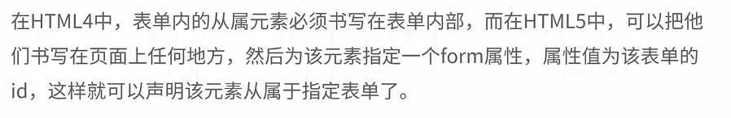

* formaction属性

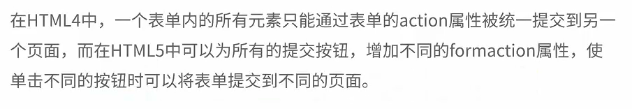

* formmethod属性

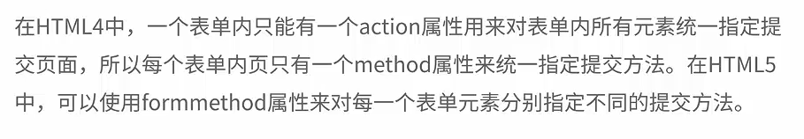

* formenctype属性

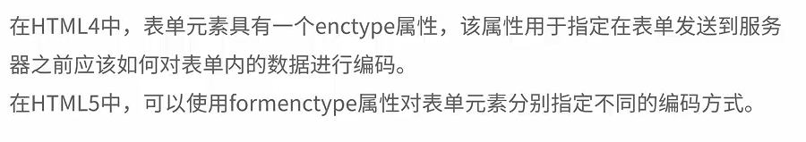

* formtarget属性

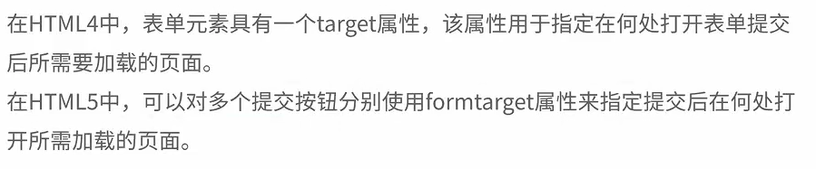

* autofocus属性

画面打开时，该控件自动获得焦点

* required属性

在提交时，如果元素中内容为空白，则不允许提交，同时在浏览器中显示信息提示文字

* labels属性

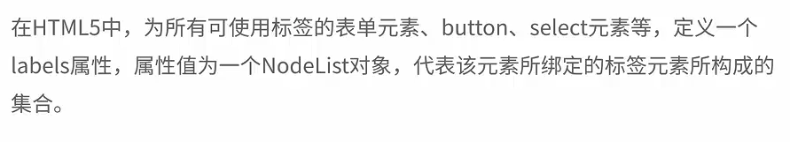

* 标签的control属性

在标签内部放置一个表单元素，并且涌过该标签的control属性来访问该表单元素

* 文本框的placeholder属性

在未输入状态时显示输入提示

* 文本框的list属性

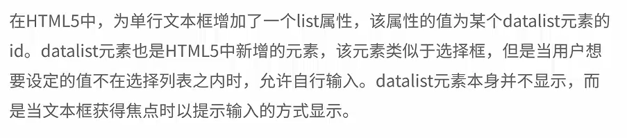

* 文本框的AutoComplete属性

帮助输入所用的自动完成功能，可以增加安全性能

* 文本框的pattern属性

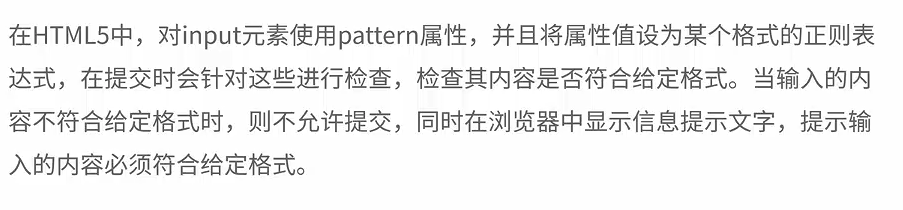

* 文本框的SelectionDirection属性(获取用户操作)

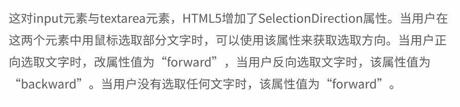

* 复选框的indeterminate属性

新增除选取或未选取以外的尚未明确选取或不选取属性

* image提交按钮的height属性与width属性