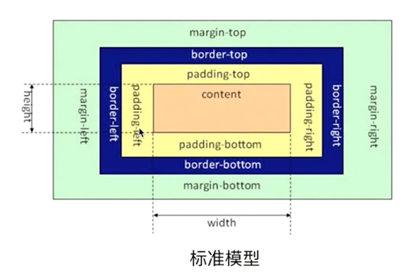
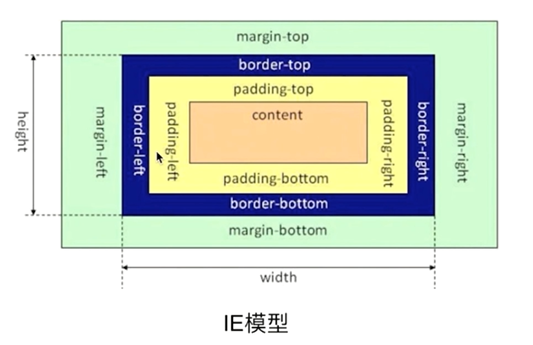
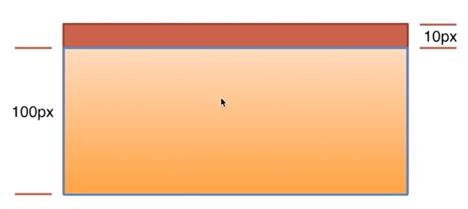

## CSS盒模型

* 题目：谈谈你对CSS盒模型的认识

* 基本概念：标准模型+IE模型

* 标准模型和IE模型的区别
  * 标准模型：
  * 
  * IE模型：
  * 
* CSS 如何设置这两种模型
  * box-sizing:content-box;  // 标准
  * box-sizing:border-box; // IE
* JS如何设置获取盒模型对应的宽和高
  * dom.style.width/height (取内联样式)
  * dom.currentStyle.width/height (渲染以后的样式，只有IE支持)
  * window.getComputedStyle(dom).width/height (兼容firefox和chrome)
  * dom.getBoundingClientRect().width/height (获取绝对位置来计算宽高)
* 实例题（根据盒模型解释边距重叠）
  * 一个块级元素内有一个块级元素，子元素的高度为100px，子元素与父元素的上边距为10px，计算父元素的实际高度
  * 
  * 代码示例：CSS盒模型实例题.html
* 边距重叠
  * 父子、兄弟、空
  * 原则是取最大值
* BFC（块级格式化上下文--边距重叠解决方案）
  * BFC原理
    * BFC垂直方向的边距会发生重叠
    * BFC的区域不会与浮动元素的box重叠，用来清除浮动
    * BFC为独立容器，内外不会相互影响
    * BFC高度计算，浮动元素也会参与计算
  * 如何创建BFC
    * overflow不为visible
    * float不为none
    * positon不为static或relative
    * display：inline-box或table相关的
  * BFC的使用场景
    * CSS盒模型实例题.html