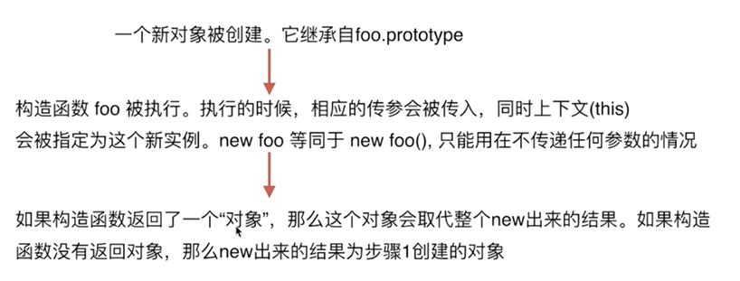
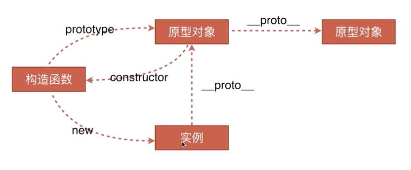
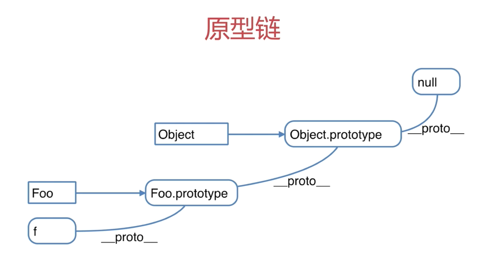
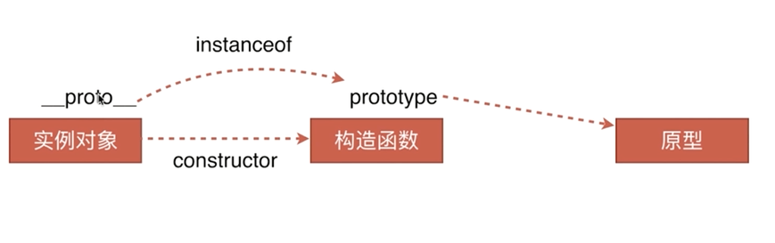

# 1 变量类型和计算

## 变量类型和计算题目

1. JS中使用typeof能得到哪些类型 （string number boolean object undefined function symbol）
2. JS中有哪些内置函数 （Object Array Boolean Number String Function Date RegExp Error）
3. 如何理解JSON （JSON只不过是一个 JS 对象而已，也可以说是一种数据格式）

### 变量类型

#### 值类型 vs 引用类型

基本类型直接存在于栈上，引用类型的栈里存指针，堆里存内容。

值类型：赋值创建两个对象

``` javascript
    var a = 100
    var b = a
    a = 200
    console.log(b)   //100
```

引用类型：对象、数组、函数，赋值只是指针的引用

``` javascript
    var a = {age:20}
    var b = a
    b.age = 21
    console.log(a.age)   //21
```

#### typeof 运算符详解

只能区分值类型的详细，除了function

``` js
    typeof undefined  //undefined
    typeof  'abc'  //string
    typeof 123  //number
    typeof true  //boolean
    typeof {}  //object
    typeof []  //object
    typeof null  //object
    typeof console.log  //function
```

### 变量计算 - 强制类型转换

# 2 原型和原型链

## 原型和原型链题目

1. 如何准确判断一个变量是数组类型（xxx instanceof Array）
2. 写一个原型链继承的例子
这个例子作为理解，最好面试别写这个

``` js
    // 动物
    function Animal() {
      this.eat = function () {
        console.log('animal eat')
      }
    }
    // 狗
    function Dog() {
      this.bark = function () {
        console.log('dog bark')
      }
    }
    Dog.prototype = new Animal()
    // 哈士奇
    var hashiqi = new Dog()
```

这是个封装DOM查询的例子

``` js
    function Elem(id) {
      this.elem = document.getElementById(id)
    }

    Elem.prototype.html = function (val) {
      var elem = this.elem
      if (val) {
        elem.innerHTML = val
        return this  // 链式操作
      } else {
        return elem.innerHTML
      }
    }

    Elem.prototype.on = function (type, fn) {
      var elem = this.elem
      elem.addEventListener(type, fn)
      return this
    }

    var div1 = new Elem('div1') //测试时改为自己想要测试id
    // console.log(div1.html())
    // div1.html('<p>hello world</p>')
    // div1.on('click',function () {
    //   alert('clicked')
    // })
    div1.html('<p>hello world</p>').on('click',function () {
      alert('clicked')
    })
    // 因为返回了this，所以可以改成这样

```
3. 描述 new 一个对象的过程
* 
  * 创建一个新对象
  * this 指向这个新对象
  * 执行代码，即对 this 赋值
  * 返回 this
  ```js
  // 模拟new运算符
    var new2 = function(func) {
      var o = Object.create(func.prototype);
      var k = func.call(o) //转移上下文
      if(typeof k === 'object'){
        return k
      } else {
        return o
      }
    }
  ```

### 构造函数(首字母大写)

``` js
    function Foo(name, age) {
      this.name = name
      this.age = age
      this.class = 'class-1'
      // return this // 默认有这一行
    }
    var f = new Foo('zhangsan', 20) // 相当于赋值this
    // var f1 = new Foo('lisi', 22)
```

### 构造函数 - 拓展

* var a = {}其实是 var a = new Object() 的语法糖
* var a = []其实是 var a  = new Array() 的语法糖
* function Foo() {...} 其实是 var Foo = new Function(...)
* 使用 instanceof 判断一个函数是否是一个变量的构造函数

### 原型规则和示例

* 所有的引用类型 (数组、对象、函数)，都具有对象特性，即可自由扩展属性（除了“null”意外）

``` js
    var obj = {}; obj.a = 100;
    var arr = []; arr.a = 100;
    function fn () {}
    fn.a = 100;

    console.log(obj.__proto__);
    console.log(arr.__proto__);
    console.log(fn.__proto__);

    console.log(fn.prototype)

    console.log(obj.__proto__ === Object.prototype )
```

* 所有的引用类型（数组、对象、函数），都有一个__proto__（隐式原型）属性，属性值是一个普通的对象
* 所有的函数，都有一个prototype（显式原型）属性，属性值也是一个普通的对象
* 所有的引用类型（数组、对象、函数），proto属性值指向它的构造函数的" prototype "属性值
* 当试图得到一个对象的某个属性时，如果这个对象本身没有这个属性，那么会去它的 __proto__（即它的构造函数的prototype）中寻找

``` js
    function Foo(name, age) {
      this.name = name
    }
    Foo.prototype.alertNmae = function () {
      alert(this.name)
    }
    // 创建示例
    var f = new Foo('zhangsan')
    f.printName = function () {
      console.log(this.name)
    }
    // 测试
    f.printName()
    f.alertName()
```

**循环对象本身的属性的方法**

``` js
    var item
    for(item in f) {
      // 高级浏览器已经在 for in 中屏蔽了来自原型的属性
      // 但是这里建议大家还是加上这个判断，保证程序的健壮性
      if(f.hasOwnProperty(item)) {
        console.log(item)
      }
    }
```

### 原型链




``` js
    function Foo(name, age) {
      this.name = name
    }
    Foo.prototype.alertNmae = function () {
      alert(this.name)
    }
    // 创建示例
    var f = new Foo('zhangsan')
    f.printName = function () {
      console.log(this.name)
    }
    // 测试
    f.printName()
    f.alertName()
    f.toString()  //要去 f.__proto__.__proto__中查找
```

### instanceof

用于判断应用类型属于哪个构造函数的方法


* f instanceof Foo 的判断逻辑是：
* f 的__proto__一层一层往上，能否对应到Foo.prototype
* 再试着判断 f instanceof Object

# 3 作用域和闭包

## 作用域和闭包题目

1. 说一下对变量提升的理解
    * 主要就是对执行上下文的理解
    * 变量定义
    * 函数声明（注意和函数表达式的区别）
2. 说明this几种不同的使用场景
    * 作为构造函数执行
    * 作为对象属性执行
    * 作为普通函数执行
    * call apply bind
3. 如何理解作用域
    * 自由变量
    * 作用域链，即自由变量的查找
    * 闭包的两个场景
4. 实际开发中闭包的应用

``` js
   // 闭包实际应用中主要用于封装变量，收敛权限
   function isFirstLoad() {
     var _list = []
     return function (id) {
       id(_list.indexOf(id) >= 0) {
         return false
       } else {
         _list.push(id)
         return true
       }
     }
   }
   // 使用
   var firstLoad = isFirstLoad()
   firstLoad(10) //true
   firstLoad(10) //false
   firstLoad(20) //true
```

### 执行上下文

``` js
console.log(a)  //undefined
var a = 100

fn('zhangsan')  // 'zhangsan' 20
function fn(name) {
  age = 20
  console.log(name, age)
  var age
}
```

在一段script或者一个函数中，在第一行之前都会先生成一个执行上下文

* 范围：一段< script >或者一个函数
* 全局：变量定义、函数声明
* 函数：变量定义、函数声明、this、arguments

**注意：** 提前的是函数声明，函数表达式只会当作变量定义提前

``` js
fn()  //不会报错
function fn () {
  //函数声明
}

//相当于 提前了 var fn1 = undefined
fn1()  // 会报错
var fn1 = function () {
  // 函数表达式
}
```

### this

**this要在执行时才会确定值，定义时无法确认**

``` js
var a = {
  name: 'A',
  fn: function () {
    console.log(this.name)
  }
}
a.fn()  // this === a
a.fn.call({name: 'B'})  // this === {name: 'B'}
var fn1 = a.fn
fn1()  // this === window
```

* 作为构造函数执行
  ``` js
  function Foo(name) {
    this = {}
    this.name = name
    return this
  }
  var f = new Foo('zhangsan')
  ```
* 作为对象属性执行
  ``` js
  var obj = {
    name : 'A',
    printName: function () {
      console.log(this.name)
    }
  }
  obj.printName()  // 'A'
  ```
* 作为普通函数执行
  ``` js
  function fn() {
    console.log(this)  //this === window
  }
  fn()
  ```
* call apply bind
  ``` js
  // 不知道call、apply、bind语法的，先去看看语法
  function fn1(name) {
    alert(name)
    console.log(this)
  }
  fn1.call({x:100}, 'zhangsan')
  // apply和bind差不多
  var fn2 = function (name,age) {
    alert(name)
    console.log(this)
  }.bind({y:200})
  fn2('zhangsan',20)
  ```

### 作用域

* 没有块级作用域
  ``` js
  if(true) {
    var name = 'zhangsan'
  }
  console.log(name) // 'zhangsan'
  ```
* 只有函数和全局作用域
  ``` js
  var a = 100
  function fn() {
    var a = 200
    console.log('fn', a)
  }
  console.log('global', a) // 100
  fn() //200
  ```

### 作用域链

``` js
var a = 100
function fn() {
  var b = 200

  // 当前作用域没有定义的变量，即“自由变量”
  // 去定义！！的时候父级作用域寻找a
  console.log(a)  //100

  console.log(b) //200
}
fn()
```

``` js
var a = 100
function F1() {
  var b = 200
  function F2() {
    var c = 300
    console.log(a)
    console.log(b)
    console.log(c)
  }
  F2()
}
F1()  //100 200 300
```

### 闭包

``` js
function F1() {
  var a = 100

  // 返回一个函数（函数作为返回值）
  return function() {
    console.log(a)  //自由变量，父作用域寻找
  }
}
// f1 得到一个函数
var f1 = F1()
var a = 200
f1()  // 100
```

### 闭包的使用场景

* 函数作为返回值（上一个demo）
* 函数作为参数传递
  ``` js
  function F1() {
    var a = 100
    return function () {
      console.log(a)
    }
  }
  var f1 = F1()

  function F2(fn) {
    var a = 200
    fn()
  }
  F2(f1)  //100

  function isFirstLoad() {
    var _list = [];
    return function (id) {
      if(_list.indexOf(id) >= 0) {
        return false;
      } else {
        _list.push(id);
        return true;
      }
    }
  }
  var firstLoad = isFirstLoad();
  firstLoad(10); // true
  firstLoad(10); // false
  firstLoad(20); // true
  ```

# 4 异步和单线程

## 异步和单线程题目

* 同步和异步的区别是什么？分别举一个同步和异步的例子(alert,settimeout,ajax)
* 前端使用异步的场景有哪些
  * 定时任务：setTimeout,setInverval
  * 网络请求：ajax请求，动态< img >加载
  * 事件绑定

### 什么是异步

``` js
console.log(100)
setTimeout(function () {
  console.log(200)
}, 1000)
console.log(300)
// 100 300 200
```

### 前端使用异步的场景

**在可能等待的情况，等待过程中不能像alert一样阻塞程序运行，因此，所有的“等待的情况”都需要异步**

* 定时任务：setTimeout,setInverval
* 网络请求：ajax请求，动态< img >加载
* 事件绑定

**ajax请求代码示例**

``` js
console.log('start')
$.get('./data1.json', function(data1) {
  console.log(data1)
})
console.log('end)
```

**< img >加载示例**

``` js
console.log('start')
var img = document.createElement('img')
img.onload = function () {
  console.log('loaded')
}
img.src = '/xxx.png'
console.log('end')
```

**事件绑定示例**

``` js
console.log('start')
decument.getElementById('btn1').addEventListener('click', function () {
  alert('clicked')
})
console.log('end')
```

### 异步和单线程

**一次只能干一个事，暂存起来的函数会根据自己的代码判断什么时候解封**

* 执行第一行，打印100
* 执行setTimeout后，传入setTimeout的函数会被暂存起来，不会立即执行（单线程的特点，不能同时干两件事）
* 执行最后一行，打印300
* 待所有程序执行完，处于空闲状态时，会立马看有没有暂存起来的要执行
* 发现暂存起来的setTimeout中的函数无需等待时间,就立即拿过来执行

# 5 日期，随机数，遍历对象和数组

## 遍历对象和数组题目

* 写一个能遍历对象和数组的通用 forEach 函数
* ``` js
  function forEach(obj, fn) {
    var key
    if (obj instanceof Array) {
      obj.forEach(function (item, index) {
        fn(index, item)
      })
    } else {
      for (key in obj) {
        fn(key, obj[key])
      }
    }
  }
  // 使用
  var arr = [1,2,3]
  forEach(arr, function (index, item) {
    console.log(index, item)
  })

  var obj = {x: 100, y: 200}
  forEach(obj, function(key, value) {
    console.log(key, value)
  })
  ```

### 日期

``` js
Date.now() // 获取当前时间毫米数 1970年至今
var dt = new Date()
dt.getTime() //获取毫米数
dt.getFullYear() //年
dt.getMonth() //月 （0-11）
dt.getDay() // 星期几 （0-6）星期日-星期六
dt.getDate() //日 （1-31）
dt.getHours() // 小时 （0-23）
dt.getMinutes() // 分钟（0-59）
dt.getSeconds()  //秒 （0-59）
```

### Math

* 获取随机数 Math.random() （放在url后面，用于清除缓存）

### 数组API

* forEach 遍历所有元素

  ``` js
  var arr = [1,2,3]
  arr.forEach(function (item, index) {  // item是每一个元素，index是数组中的顺序
    console.log(index, item)
  })
  ```

* every 判断所有元素是否都符合条件

  ``` js
  var arr = [1,2,3]
  var result = arr.every(function (item, index) {
    if(item < 4) {
      return true
    }
  })
  console.log(result)  //true
  ```

* some 判断是否至少一个元素符合条件

  ``` js
  var arr = [1,2,3]
  var result = arr.some(function (item, index) {
    if(item < 2) {
      return true
    }
  })
  console.log(result)  //true
  ```

* sort 排序

  ``` js
  var arr = [1,4,2,3,5]
  var arr2 = arr.sort(function (a, b) {
    // 从小到大排序
    return a - b
    // 从大到小排序
    // return b - a
  })
  console.log(arr2)
  ```

* map 对元素重新组装，生成新数组

  ``` js
  var arr = [1,2,3,4]
  var arr2 = arr.map(function(item, index) {
    // 将元素重新组装，并返回
    return '<b>' + item + '</b>'
  })
  console.log(arr2)
  ```

* filter 过滤符合条件的元素

  ``` js
  var arr = [1,2,3]
  var arr2 = arr.filter(function (item, index) {
    // 通过某条件过滤数组
    if (item >= 2) {
      return true
    }
  })
  console.log(arr2) // [2,3]
  ```

### 对象API

* for in

  ``` js
  var obj = {
    x: 100,
    y: 200,
    z: 300
  }
  var key
  for (key in obj) {
    // 注意这里的hasOwnProperty，在讲原型链的时候讲过了
    if (obj.hasOwnProperty(key)) {
      console.log(key, obj[key])
    }
  }
  // x 100
  // y 200
  // z 300
  ```

# 6 DOM操作和BOM操作

## 6.1  DOM操作（Document Object Model）

### DOM操作题目

* DOM是哪种基本的数据结构？（树）
* DOM操作的常用API有哪些
  * 获取DOM节点，以及节点的property和Attribute
  * 获取父节点，获取子节点
  * 新增节点，删除节点
* DOM节点的attr和property有何区别
  * property只是一个JS对象的属性的修改
  * Attribute是对html标签属性的修改

### DOM的本质

DOM（Document Object Model——文档对象模型）是用来呈现以及与任意 HTML 或 XML 交互的API文档。DOM 是载入到浏览器中的文档模型，它用节点树的形式来表现文档，每个节点代表文档的构成部分（例如： element——页面元素、字符串或注释等等）。
DOM可以理解为浏览器把拿到的HTML代码，结构化为一个浏览器能识别并且js可操作的模型。

BOM（Browser Object Document）即浏览器对象模型。
BOM提供了独立于内容 而与浏览器窗口进行交互的对象；
由于BOM主要用于管理窗口与窗口之间的通讯，因此其核心对象是window；
BOM由一系列相关的对象构成，并且每个对象都提供了很多方法与属性

### DOM节点操作

* 获取DOM节点

  ``` js
  var div1 = document.getElementById('div1') // 元素
  var divList = document.getElementsByTagName('div') // 集合
  console.log(divList.length)
  console.log(divList[0])

  var containerList = document.getElementsByClassName('.container') // 集合
  var pList = document.querySelectorAll('p') // 集合
  ```

* prototype

  ``` js
  var pList = document.querySelectorAll('p')
  var p = pList[0]
  console.log(p.style.width)  // 获取样式
  p.style.width = '100px'  //修改样式
  console.log(p.className) // 获取class
  p.className = 'p1' // 修改class

  // 获取 nodeName 和nodeType
  console.log(p.nodeName)
  console.log(p.nodeType)
  ```

* Attribute(有关文档的标签属性)
  标签属性，用于扩充HTML标签，可以改变标签行为或提供数据，格式为name=value

  ``` js
  var pList = document.querySelectorAll('p')
  var p = pList[0]
  p.getAttribute('data-name')
  p.setAttribute('data-name', 'hello')
  p.getAttribute('style')
  p.setAttribute('style', 'font-size:30px')
  ```

### DOM结构操作

* 新增节点

  ```js
  var div1 = document.getElementById('div1')
  // 添加新节点
  var p1 = document.createElement('p')
  p1.innerHTML = 'this is p1'
  div1.appendChild(p1) // 添加新创建的元素
  // 移动已有节点
  var p2 = document.getElementById('p2')
  div1.appendChild(p2)
  ```

* 获取父元素

  ``` js
  var div1 = document.getElementById('div1')
  var parent = div1.parentElement
  ```

* 获取子元素

  ``` js
  var div1 = document.getElementById('div1')
  var child = div1.childNodes
  ```

* 删除节点

  ``` js
   var div1 = document.getElementById('div1')
   div1.removeChild(child[0])
  ```

## 6.2  BOM操作（Browser Object Model）

### BOM操作题目

* 如何检测浏览器的类型
* 拆解url的各部分

### navigator & screen

``` js
// navigator
var ua = navigator.userAgent
var isChrome = ua.indexOf('Chrome')
console.log(isChrome)

//screen
console.log(screen.width)
console.log(screen.height)
```

### location & history

```js
// location
console.log(location.href) //整个URL
console.log(location.protocal) // 'http:' 'https:'
console.log(location.pathname) // '/learn/199'
console.log(location.search) // 问号后面的查询字符串
console.log(location.hash) // 哈希

// history
history.back()
history.forward()
//页面上返回功能
var a = document.createElement('a');
a.innerHTML = '<input type="button" id="btn" name="" value="后退">'
document.body.append(a);
var  btn = document.getElementById('btn');
btn.onclick = function(){
    prev()
}
function  prev(){
    history.back()
}
```

# 7 事件、Ajax、存储

## 7.1  事件

* 基础概念：DOM事件的级别
  * DOM0: element.onclick=function(){}
  * DOM2: element.addEventListener('click',function(){},false)
  * DOM3: element.addEventListener('keyup',function(){},false)
* DOM事件模型（冒泡，捕获）
* DOM事件流(浏览器在和用户做交互的过程中，交互怎么传到页面上)
  * 第一阶段：捕获交互
  * 第二阶段：目标阶段
  * 第三阶段：冒泡阶段反馈
* 描述DOM事件捕获的具体流程
  * window
  * document
  * html
  * body
  * ......
  * 目标元素
* Event对象的常见应用  //TODO 查询更多应用
  * event.preventDefault()  //阻止默认事件
  * event.stopPropagation()  //阻止冒泡
  * event.stopImmediatePropagation()  //多个click事件阻止后续click事件执行
  * event.currentTarget  //当前绑定事件
  * event.target //判断子元素中哪个被交互
* 自定义事件

  ```js
  var eve = new Event('custome');
  ev.addEventListener('custome',function() {
    console.log('custome');
  });
  // 触发
  ev.dispatchEvent(eve);
  ```
### 事件题目

* 描述事件冒泡流程
  * DOM树型结构
  * 事件冒泡
  * 阻止冒泡
  * 冒泡的应用
* 对于一个无限下拉加载图片的页面，如何给每个图片都绑定事件
  * 代理，e.target知道是哪个图片

* Event对象的常见应用  //TODO 查询更多应用
  * event.preventDefault()  //阻止默认事件
  * event.stopPropagation()  //阻止冒泡
  * event.stopImmediatePropagation()  //多个click事件阻止后续click事件执行
  * event.currentTarget  //当前绑定事件
  * event.target //判断子元素中哪个被交互
* 自定义事件

  ```js
  var eve = new Event('custome');
  ev.addEventListener('custome',function() {
    console.log('custome');
  });
  // 触发
  ev.dispatchEvent(eve);
  ```

### 通用事件绑定

``` js
// 常用事件绑定
var btn = document.getElementById('btn1')
btn.addEventListener('click', function (event) {
  console.log('clicked')
})

// 简单的封装事件绑定
function bindEvent(elem, type, fn) {
  elem.addEventListener(type, fn)
}
var a = document.getElementById('link1')
bindEvent(a, 'click', function(e) {
  e.preventDefault() // 阻止默认行为
  alert('clicked')
})

// 完善通用绑定事件的函数
function bindEvent(elem, type, selector, fn) {
  if(fn == null) {
    fn = selector
    selector = null
  }
  elem.addEventListener(type, function(e) {
    var target
    if(selector) {
      target = e.target
      if (target.matches(selector)) {
        fn.call(target, e)
      }
    } else {
       fn(e)
    }
  })
}

//使用代理
var div1 = document.getElementById('div1')
bindEvent(div1, 'click', 'a', function (e) {
  console.log(this.innerHTML)
})

// 不使用代理
var a = document.getElementById('a1')
bindEvent(div1, 'click', function (e) {
  console.log(a.innerHTML)
})
```

关于IE低版本的兼容性

* IE低版本使用attachEvent绑定事件，和W3C标准不一样
* IE低版本使用量以非常少，很多网站都早已不支持
* 建议对IE低版本的兼容性：了解即可，无需深究
* 如果遇到对IE低版本要求苛刻的面试，果断放弃

### 事件冒泡

底层节点会一层一层触发父节点的事件

``` html
<!-- 要求：点击激活弹出激活，点击取消弹出取消 -->
<body>
  <div id = "div1">
    <p id="p1">激活</p>
    <p id="p2">取消</p>
    <p id="p3">取消</p>
    <p id="p4">取消</p>
  </div>
  <div id = "div2">
    <p id="p5">取消</p>
    <p id="p6">取消</p>
  </div>
 </body>
```

``` js
var p1 = document.getElementById('p1')
var body = document.body
bindEvent(p1, 'click', function (e) {
  e.stopPropatation()  //取消冒泡
  alert('激活')
})
bindEvent(body, 'click', function(e) {
  alert('取消')
})
```

### 代理

其实就是对于事件冒泡的应用

``` html
<!-- 要求：点击不同的a标签，弹出对应a标签的内容 -->
<body>
  <div id = "div1">
    <a href="#">a1</a>
    <a href="#">a2</a>
    <a href="#">a3</a>
    <a href="#">a4</a>
    <!-- 会随时新增更多的 a 标签 -->
  </div>
 </body>
```

``` js
// 直接把事件绑定在div1上
var div1 = document.getElementById('div1')
div1.addEventListener('click', function (e) {
  var target = e.target  // target会知道点击事件从哪触发的
  if (target.nodeName === 'A') {
    alert(target.innerHTML)
  }
})
```

代理的好处

* 代码简洁
* 减少浏览器内存占用

## 7.2  Ajax

### Ajax题目

* 手动编写一个ajax，不依赖第三方库
* 跨域的几种实现方式
  * JSONP
    * 原理：script标签可以跨域，首先通过script标签发送请求，并告诉服务器端回调函数名，服务端返回一段script代码，将传过来的data放进回调函数中运行,jsonp为全局函数

      ``` html
      <script src="http://www.abc.com/?data=name&callback=jsonp"></script>

      <script>
        jsonp({
          data: {
          }
        })
      </script>
      ```

  * Hash
    * 原理：利用url中#后面的字符改变页面不会刷新
    * 场景是当前页面A通过iframe或frame嵌入了跨域的页面B

    ``` js
    //在A中伪代码如下
    var B = document.getElementsByTagName('iframe');
    B.src = B.src+'#'+'data'
    //在B中的伪代码如下
    window.onhashchange = function() {
      var data = window.location.hash
    }
    ```

  * postMessage（H5加的）

    ``` js
    // 窗口A（http:A.com）向跨域的窗口B（http:B.com）发送信息
    Bwindow.postMessage('data', 'http://B.com');
    // 在窗口B中监听
    window.addEventListener('message', function(event) {
      console.log(event.origin); // http://A.com
      console.log(event.source); //Bwindow
      console.log(event.data); //data!
    }, false);
    ```

  * WebSocket

    ```js
    var ws = new WebSocket('wss://echo.websocket.org');

    ws.onopen = function (evt) {
      console.log('Connection open ...')
      ws.send('Hello')
    }

    ws.onmessage = function (evt) {
      console.log('Received Message: ' + evt.data);
      ws.close;
    }

    ws.onclose = function (evt) {
      console.log('Connection closed.')
    }
    ```

  * CORS（支持跨域通信的ajax）

    ```js
    fetch('/some/url', {
      method: 'get',
    }).then(function (response) {

    }).catch(function (err) {
    })
    ```
### XMLHttpRequest

``` js
var xhr = new XMLHttpRequest()
xhr.open("GET", "/api", false)
xhr.onreadystatechange = function () {
  // 这里的函数异步执行，可参考之前的chapter4的异步模块
  if (xhr.readyState == 4) {
    if (xhr.status == 200) {
      alert(xhr.responseText)
    }
  }
}
xhr.send(null)
```

IE兼容性问题

* IE低版本使用ActiveXObject

### 状态码说明

* readyState
  * 0 - （未初始化）还没有调用send()方法
  * 1 - （载入）已调用send()方法，正在发送请求
  * 2 - （载入完成）send()方法执行完成，已经接收到全部响应内容
  * 3 - （交互）正在解析响应内容
  * 4 - （完成）响应内容解析完成，可以在客户端调用了

* status
  * 2xx - 表示成功处理请求。如200
  * 3xx - 需要重定向，浏览器直接跳转
  * 4xx - 客户端请求错误，如404
  * 5xx - 服务器端错误

### 跨域

* 什么是同源策略及限制
  * 同源策略限制从一个源加载的文档或脚本如何与来自另一个源的资源进行交互。这是一个用于隔离潜在恶意文件的关键的安全机制。
  * Cookie、LocalStorage和IndexDB无法读取
  * DOM无法获得
  * AJAX请求不能发送
* 什么是跨域
  * 浏览器有同源策略，不允许ajax访问其他域接口
  * 跨域条件：协议、域名、端口，有一个不同就算跨域
  * 可以跨域的三个标签
    * < img src=xxx> 用于打点统计，统计网站可能是其他域
    * < link href=xxxx> 可以使用CDN，CDN的也是其他域
    * < script src=xxx> 可以用于JSONP
  * 跨域注意事项
    * 所有的跨域请求都必须经过信息提供方允许
    * 如果未经允许即可获取，那是浏览器同源策略出现漏洞
* JSONP
  * 原理：script标签可以跨域，首先通过script标签发送请求，并告诉服务器端回调函数名，服务端返回一段script代码，将传过来的data放进回调函数中运行,jsonp为全局函数
  ``` js html
  <script>
  window.callback = function (data) {
    // 这是我们跨域得到的信息
    console.log(data)
  }
  </script>
  <script src="http://baidu.com/api.js"></script>
  ```

* 服务器端设置http header
  * 另外一个解决跨域的简洁方法，需要服务器端来做
  * 但是作为交互方，我们必须知道这个方法
  * 是将来解决跨域问题的一个趋势

* Hash
  * 原理：利用url中#后面的字符改变页面不会刷新
  * 场景是当前页面A通过iframe或frame嵌入了跨域的页面B

    ``` js
    //在A中伪代码如下
    var B = document.getElementsByTagName('iframe');
    B.src = B.src+'#'+'data'
    //在B中的伪代码如下
    window.onhashchange = function() {
      var data = window.location.hash
    }
    ```

* postMessage（H5加的）

    ``` js
    // 窗口A（http:A.com）向跨域的窗口B（http:B.com）发送信息
    Bwindow.postMessage('data', 'http://B.com');
    // 在窗口B中监听
    window.addEventListener('message', function(event) {
      console.log(event.origin); // http://A.com
      console.log(event.source); //Bwindow
      console.log(event.data); //data!
    }, false);
    ```

* WebSocket

    ```js
    var ws = new WebSocket('wss://echo.websocket.org');

    ws.onopen = function (evt) {
      console.log('Connection open ...')
      ws.send('Hello')
    }

    ws.onmessage = function (evt) {
      console.log('Received Message: ' + evt.data);
      ws.close;
    }

    ws.onclose = function (evt) {
      console.log('Connection closed.')
    }
    ```

* CORS（支持跨域通信的ajax）

    ```js
    fetch('/some/url', {
      method: 'get',
    }).then(function (response) {

    }).catch(function (err) {
    })
    ```

## 7.3  存储

### 存储题目

* 请描述一个cookie，sessionStorage和localStorage的区别？
  * 容量
  * 是否会携带到ajax中
  * API易用性

#### cookie

* 本身用于客户端和服务器端通信
* 但是它有本地存储的功能，于是就被“借用”
* 使用 document.cookie = ... 获取和修改即可
* cookie用于存储的缺点
  * 存储量太小,只有4KB
  * 所有http请求都带着，会影响获取资源的效率
  * API简单，需要封装才能用 document.cookie

#### localStorage 和 sessionStorage

* HTML5专门为存储而设计，最大容量5M
* API简单易用
* localStorage.setItem(key, value); localStorage.getItem(key);
* iOS safari 隐藏模式下，localStorage.getItem会报错

# 8  JS开发环境

## 8.2  Git

### 常用Git命令

* git add .  // 增加某个或全部文件
* git checkout xxx // 取消某个文件
* git commit -m "xxx" //提交本地仓库 后面是备注
* git push origin master // 提交远程仓库的master分支
* git pull origin master // 获取
* git branch // 当前分支
* git checkout -b xxx / git checkout xxx // 新建分支，切换分支
* git merge xxx // 合并分支代码

### 打包工具

#### webpack

* 参看专门说明webpack的文章

### 上线和回滚

#### 1.上线和回滚的基本流程

* 上线流程的要点
  * 将测试完成的代码提交到git版本库的master分支
  * 将当前服务器的代码全部打包并记录版本号，备份
  * 将master分支的代码提交覆盖到线上服务器，生成新版本号
* 回滚流程要点
  * 将当前服务器的代码打包并记录版本号，备份
  * 将备份的上一个版本号解压，覆盖到线上服务器，并生成新的版本号

#### 2. linux基本命令

``` cmd
mkdir a
ls
ll
cd a
pwd
cd ../
rm -rf a
vi a.js
cp a.js a1.js
mkdir src
mv a1.js src/a1.js
rm a.js
cat a.js
head -n 1 a.js
tail -n 2 a.js
grep '2' a.js
```

# 9  JS运行环境

### 1. 页面加载

#### 页面加载题目

* 从输入url到得到html的详细过程
* window.onload 和 DOMContentLoaded 的区别

#### 页面加载知识点

* 加载资源的形式
  * 输入url（或跳转页面）加载html
  * 加载html中的静态资源
* 加载一个资源的过程
  * 浏览器根据DNS服务器得到域名的IP地址
  * 向这个IP的及其发送 http 请求
  * 服务器收到、处理并返回http请求
  * 浏览器得到返回内容
* 浏览器渲染页面的过程
  * 根据HTML结构生成 DOM Tree
  * 根据 CSS 生成后 CSSOM
  * 将 DOM和CSSOM 整合形成 RenderTree
  * 根据RenderTree开始渲染和展示
  * 遇到 < script >时，会执行并阻塞渲染

## postHead

