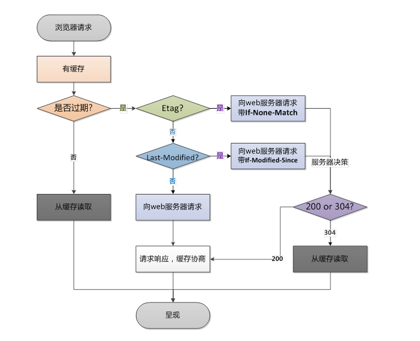

## 页面性能

项目中使用过：

1. 使用虚拟dom进行一次插入，减少dom操作
2. 其他的主要还是使用浏览器缓存：
* 缓存的分类
     * 强缓存：Expires(Expires:Thu,21 Jan 2017 23:39:02 GMT)绝对时间、Cache-Control(Cache-Control:max-age=3600)相对时间
     * 协商缓存：Last-Modified（这个响应资源的最后修改时间）、If-Modified-Since（）、Etag（web服务器响应请求时，告诉浏览器当前资源在服务器的唯一标识）、If-None-Match
   * 缓存的原理
   
1. 静态资源压缩合并，减少HTTP请求，除了一个global以外，我把其他的js资源都整合在一起
2. 使用gzip，查看浏览器的Content-Encoding，然后是后台用gzip，现在node我会用库函数zlib里面有个createGzip
4. 使用CDN版的jquery
2. 非核心代码异步加载（对于那些不重要的js就让他异步加载）
   * 异步加载的方式
     * 动态脚本加载
     * defer
     * async
   * 异步加载的区别
     * defer是在HTML解析完之后才会执行，如果是多个，按照加载的顺序依次执行
     * async是在加载完之后立即执行，如果是多个，执行顺序和加载顺序无关

其他还有的一些优化方案比如：
5. 预解析DNS（加一个meta头）
```html
<!-- https协议打开a标签dns预解析 -->
<meta http-equiv="x-dns-prefetch-control" content="on">
<!-- 打开dns预解析 -->
<link rel="dns-prefetch" href="//host_name_to_prefetch.com">
```
6. 事件节流

  ``` js
  var textarea = document.getElementById('text')
  var timeoutId
  textarea.addEvemtListener('keyup', function () {
    if (timeoutId) {
      clearTimeout(timeoutId)
    }
    timeoutId = setTimeout(function () {
      // 触发 change 事件
    }, 100)
  })
  ```

6. 使用SSR 后端渲染，数据直接输出到HTML中
  * 现在 Vue React 提出了这样的概念
  * 其实 jsp php asp 都属于后端渲染
8. 懒加载（图片懒加载、下拉加载更多）
7. CSS放前面，JS放后面