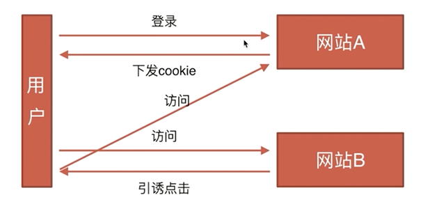

## 安全类

* CSRF（Cross-site request forgery）
  * 基本概念和缩写
    * CSRF,通常称为跨站请求伪造
  * 攻击原理
    * 在A网站登陆过
    * A网站某个链接存在漏洞
  
  * 防御措施
    * 关键操作用post
    * 使用验证码
    * Token验证
    * Referer验证
    * 隐藏令牌
* XSS（cross-site scripting）
  * 跨域脚本攻击
  * 在新浪博客写一篇文章，同时偷偷插入一段< script >
  * 攻击代码中，获取cookie，发送到自己的服务器
  解决方法

  * 前端用字符实体替换关键字，例如替换 < 为 & lt;
  * 后端替换
  * 在后端设置cookie的httponly属性，js就无法读写了
* DDOS
* sql注入
  * 不直接使用sql语句动态拼接