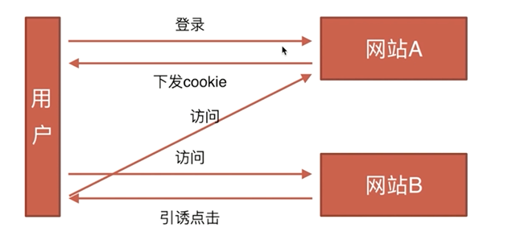

# 前端基础知识

## 页面布局

* 题目：假设高度已知，请写出三栏布局，其中左栏、右栏宽度各为300px，中间自适应(见页面布局中的 三栏布局.html)
  * flex-box
  * grid
  * float
  * 绝对定位
  * table

* 每个解决方案的优缺点
  * float 脱离文档流  兼容性好
  * 绝对定位 布局脱离文档流，适用性差 快捷
  * flex-box 兼容性较差 最好的
  * table 一个单元格高度超出，其他单元高度也提高 兼容性较好
  * grid
* 假设把高度去掉，哪个方案不适应了
  * flex、table能用
* 5个解决方案的兼容性

### 页面布局小结

* 语意化掌握到位
* 页面布局理解深刻
* CSS基础知识扎实
* 思维灵活且积极上进
* 代码书写规范

### 拓展

* 三栏布局
  * 左右宽度固定，中间自适应
  * 上下高度固定，中间自适应
* 两栏布局
  * 左宽度固定，右自适应
  * 右宽度固定，左自适应
  * 上宽度固定，下自适应
  * 下宽度固定，上自适应

## CSS盒模型

* 题目：谈谈你对CSS盒模型的认识

* 基本概念：标准模型+IE模型

* 标准模型和IE模型的区别
  * 标准模型：
  * 
  * IE模型：
  * 
* CSS 如何设置这两种模型
  * box-sizing:content-box;  // 标准
  * box-sizing:border-box; // IE
* JS如何设置获取盒模型对应的宽和高
  * dom.style.width/height (取内联样式)
  * dom.currentStyle.width/height (渲染以后的样式，只有IE支持)
  * window.getComputedStyle(dom).width/height (兼容firefox和chrome)
  * dom.getBoundingClientRect().width/height (获取绝对位置来计算宽高)
* 实例题（根据盒模型解释边距重叠）
  * 一个块级元素内有一个块级元素，子元素的高度为100px，子元素与父元素的上边距为10px，计算父元素的实际高度
  * 
  * 代码示例：CSS盒模型实例题.html
* 边距重叠
  * 父子、兄弟、空
  * 原则是取最大值
* BFC（块级格式化上下文--边距重叠解决方案）
  * BFC原理
    * BFC垂直方向的边距会发生重叠
    * BFC的区域不会与浮动元素的box重叠，用来清除浮动
    * BFC为独立容器，内外不会相互影响
    * BFC高度计算，浮动元素也会参与计算
  * 如何创建BFC
    * overflow不为visible
    * float不为none
    * positon不为static或relative
    * display：inline-box或table相关的
  * BFC的使用场景
    * CSS盒模型实例题.html

## DOM事件类

* 基础概念：DOM事件的级别
  * DOM0: element.onclick=function(){}
  * DOM2: element.addEventListener('click',function(){},false)
  * DOM3: element.addEventListener('keyup',function(){},false)
* DOM事件模型（冒泡，捕获）
* DOM事件流(浏览器在和用户做交互的过程中，交互怎么传到页面上)
  * 第一阶段：捕获交互
  * 第二阶段：目标阶段
  * 第三阶段：冒泡阶段反馈
* 描述DOM事件捕获的具体流程
  * window
  * document
  * html
  * body
  * ......
  * 目标元素
* Event对象的常见应用  //TODO 查询更多应用
  * event.preventDefault()  //阻止默认事件
  * event.stopPropagation()  //阻止冒泡
  * event.stopImmediatePropagation()  //多个click事件阻止后续click事件执行
  * event.currentTarget  //当前绑定事件
  * event.target //判断子元素中哪个被交互
* 自定义事件

  ```js
  var eve = new Event('custome');
  ev.addEventListener('custome',function() {
    console.log('custome');
  });
  // 触发
  ev.dispatchEvent(eve);
  ```

* 示例
  * 见DOM事件类.html

## HTTP协议类

* HTTP协议的主要特点
  * 简单快速（统一资源符固定）
  * 灵活（可完成不同数据类型传输）
  * 无连接
  * 无状态
* HTTP报文的组成部分
  * 请求报文：请求行，请求头，空行，请求体
  * 响应报文：状态行，响应头，空行，响应体
* HTTP方法
  * GET  -- 获取资源
  * POST  --  传输资源
  * PUT  --  更新资源
  * DELETE  --  删除资源
  * HEAD  --  获得报文首部
* POST和GET的区别
  * GET在浏览器回退是无害的，而POST会再次提交请求 *
  * GET产生的URL地址可以被收藏，而POST不可以
  * GET请求会被浏览器主动缓存，而POST不会，除非手动设置 *
  * GET请求只能进行url编码，而POST支持多种编码方式
  * GET请求参数会被完整保留在浏览器历史记录中，而POST参数不会被保留 *
  * GET请求在URL中传送的参数是有长度限制的，而POST没有限制 *
  * 对参数的数据类型，GET只接收ASCII字符，而POST没有限制
  * GET比POST更不安全，因为参数直接暴露在URL上，所以不能用来传递敏感信息 *
  * GET参数通过URL传递，POST放在Request body中 *
* HTTP状态码
  * 1xx: 提示信息 -- 表示请求已接收，继续处理
  * 2xx：成功 -- 表示请求已被成功接收
  * 3xx：重定向 -- 要完成请求必须进行更进一步的操作
  * 4xx：客户端错误 -- 请求有语法错误或请求无法实现
  * 5xx：服务器端错误 -- 服务器未能实现合法的请求
* 什么是持久连接（HTTP 1.1支持持久连接）
  * HTTP协议采用“请求-应答”模式，当使用普通模式，即非Keep-Alive模式时，每个请求/应答客户和服务器都要新建一个连接，完成之后立即断开连接（HTTP协议为无连接的协议）
  * 当使用Keep-Alive模式（又称持久连接、连接复用）时，Keep-Alive功能使客户端到服务器端的连接持久有效，当出现对服务器的后继请求时，Keep-Alive功能避免了建立或者重新建立连接
* 什么是管线化
  * 请求和响应不一定是一对一的，可能进行请求打包传去，响应也打包传回

## 原型链类

* 创建对象有几种方法

  ```js
  var o1 = {name:'o1'}
  var o11 = new Object({name:'o11'})

  var M = function(){this.name='o2'}
  var o2 = new M()

  var P = {name:'o3'}
  var o3 = Object.create(P)
  ```

* 原型、构造函数、实例、原型链
  * 
* instanceof的原理
  * 
* new运算符
  * 

## 面向对象类

### 类与实例

* 类的声明

* 生成实例

### 类与继承

* 如何实现继承

* 继承的几种方式

## 通信类

* 什么是同源策略及限制
  * 同源策略限制从一个源加载的文档或脚本如何与来自另一个源的资源进行交互。这是一个用于隔离潜在恶意文件的关键的安全机制。
  * Cookie、LocalStorage和IndexDB无法读取
  * DOM无法获得
  * AJAX请求不能发送
* 前后端如何通信
  * Ajax  //同源
  * WebSocket  //不仅同源
  * CORS
* 如何创建Ajax
  * XMLHttpRequest对象的工作流程
  * 兼容性处理
  * 事件的触发条件
  * 事件的触发顺序
* 跨域通信的几种方式
  * JSONP
    * 原理：script标签可以跨域，首先通过script标签发送请求，并告诉服务器端回调函数名，服务端返回一段script代码，将传过来的data放进回调函数中运行,jsonp为全局函数

    ``` html
    <script src="http://www.abc.com/?data=name&callback=jsonp"></script>

    <script>
      jsonp({
        data: {
        }
      })
    </script>
    ```

  * Hash
    * 原理：利用url中#后面的字符改变页面不会刷新
    * 场景是当前页面A通过iframe或frame嵌入了跨域的页面B

    ``` js
    //在A中伪代码如下
    var B = document.getElementsByTagName('iframe');
    B.src = B.src+'#'+'data'
    //在B中的伪代码如下
    window.onhashchange = function() {
      var data = window.location.hash
    }
    ```

  * postMessage（H5加的）

    ``` js
    // 窗口A（http:A.com）向跨域的窗口B（http:B.com）发送信息
    Bwindow.postMessage('data', 'http://B.com');
    // 在窗口B中监听
    window.addEventListener('message', function(event) {
      console.log(event.origin); // http://A.com
      console.log(event.source); //Bwindow
      console.log(event.data); //data!
    }, false);
    ```

  * WebSocket

    ```js
    var ws = new WebSocket('wss://echo.websocket.org');

    ws.onopen = function (evt) {
      console.log('Connection open ...')
      ws.send('Hello')
    }

    ws.onmessage = function (evt) {
      console.log('Received Message: ' + evt.data);
      ws.close;
    }

    ws.onclose = function (evt) {
      console.log('Connection closed.')
    }
    ```

  * CORS（支持跨域通信的ajax）

    ```js
    fetch('/some/url', {
      method: 'get',
    }).then(function (response) {

    }).catch(function (err) {
    })
    ```

## 安全类

* CSRF（Cross-site request forgery）
  * 基本概念和缩写
    * CSRF,通常称为跨站请求伪造
  * 攻击原理
    * 在A网站登陆过
    * A网站某个链接存在漏洞
  
  * 防御措施
    * Token验证
    * Referer验证
    * 隐藏令牌
* XSS（cross-site scripting）
  * 跨域脚本攻击

## 算法类

* 排序
  * 快速排序：https://segmentfault.com/a/1190000009426421
  * 选择排序：https://segmentfault.com/a/1190000009366805
  * 希尔排序：https://segmentfault.com/a/1190000009461832
* 堆栈、队列、链表
* 递归：https://segmentfault.com/a/1190000009857470
* 波兰式和逆波兰式
  * 理论：http://www.cnblogs.com/chenying99/p/3675876.html