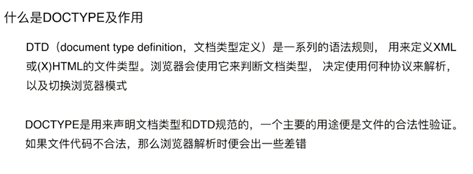
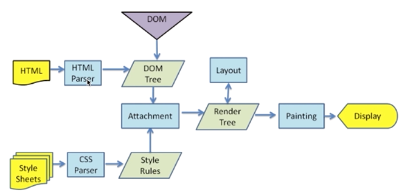
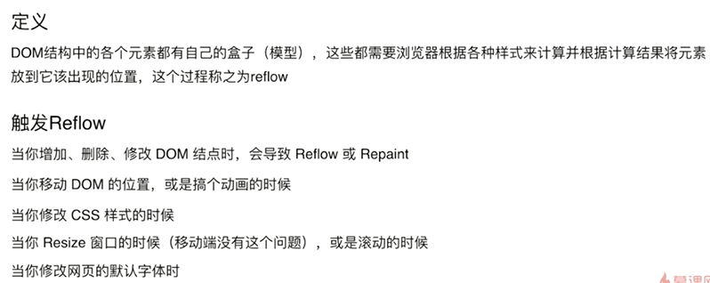
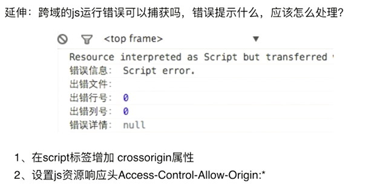

# 前端深度辅助知识

## 渲染机制

* 什么是DOCTYPE及作用



* 浏览器渲染过程



* 重排Reflow



* 重绘Repaint
  * 定义：当各种盒子的位置、大小以及其他属性，例如颜色、字体大小等都确定下来后，浏览器于是便把这些元素都按照各自的特性绘制了一遍，于是页面的内容出现了，这个过程称之为repaint
  * 触发条件：DOM改动，CSS改动
* 布局Layout

## JS运行机制

* 什么是单线程
* 什么是任务队列
* 怎么理解Event Loop（事件循环）

同步任务队列全部完成后，才会执行异步任务队列（setTimeout、setInterval、DOM事件、ES6中的Promise）

```js
console.log(1);
setTimeout(function () {
  console.log(3);
},0)
console.log(2);
// 1 2 3
```

## 页面性能

题目：提升页面性能的方法有哪些？

1. 资源压缩合并，减少HTTP请求
2. 非核心代码异步加载
   * 异步加载的方式
     * 动态脚本加载
     * defer
     * async
   * 异步加载的区别
     * defer是在HTML解析完之后才会执行，如果是多个，按照加载的顺序依次执行
     * async是在加载完之后立即执行，如果是多个，执行顺序和加载顺序无关

3. 利用浏览器缓存(最重要)
   * 缓存的分类
     * 强缓存：Expires(Expires:Thu,21 Jan 2017 23:39:02 GMT)绝对时间、Cache-Control(Cache-Control:max-age=3600)相对时间
     * 协商缓存：Last-Modified、If-Modified-Since、Etag、If-None-Match
   * 缓存的原理

4. 使用CDN
5. 预解析DNS

```html
<!-- https协议打开a标签dns预解析 -->
<meta http-equiv="x-dns-prefetch-control" content="on">
<!-- 打开dns预解析 -->
<link rel="dns-prefetch" href="//host_name_to_prefetch.com">
```

## 错误监控

* 前端错误的分类
  * 即时运行错误：代码错误
  * 资源加载错误
* 错误的捕获方式
  * 即时运行错误的捕获方式
    * try...catch
    * window.onerror
  * 资源加载错误
    * object.onerror
    * performance.getEntries()
    * Error事件捕获
  * 延伸：跨域的js运行错误可以捕获吗，错误提示什么，应该怎么处理？
  
* 上报错误的基本原理
  * 采用Ajax通信的方式上报
  * 利用Image对象上报（主要的）